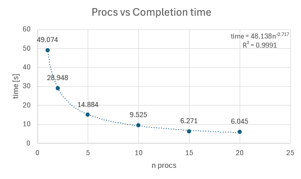
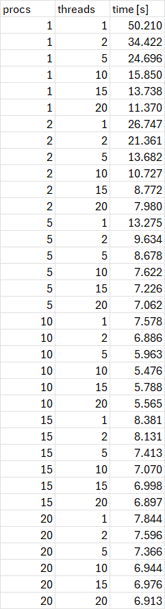

# System Programming Lab 11/12 Multiprocessing and Multithreading
## Multiprocessing Implementation
The multiprocessing was implemeted using a shared memory object to contain a struct with all of the image parameters, updating the scale for each iteration/frame. The program creates n processes to split up the processing cost of multiple frames and keeps track of active procs using a seperate varibale in the struct.
## Results Varying Procs

### Discussion
The program was tested using the run command `time ./mandel_movie -x -0.7849927743249281 -y 0.14659168099751696 -s 0.0009044129401445389 -m 3300 -n <num procs>`, and the video file was created using `ffmpeg -i mandel%d.jpg mandel.mpg`. The program is very slow without any child processes, but it speeds up dramatically as more are used. The speed begins to platau around 10-15 processes, which makes sense because the computer used has a total of 12 logical processors.
## Results of Varying Procs and Threads

### Discussion
Multiprocessing appears to have a greater impact on the runtime of the program. This could be due to the multiprocessing and multithreading each doing different tasks in the program. The minimum runtime was achieved using 10 processes and 10 threads, with a time of 5.476 seconds.